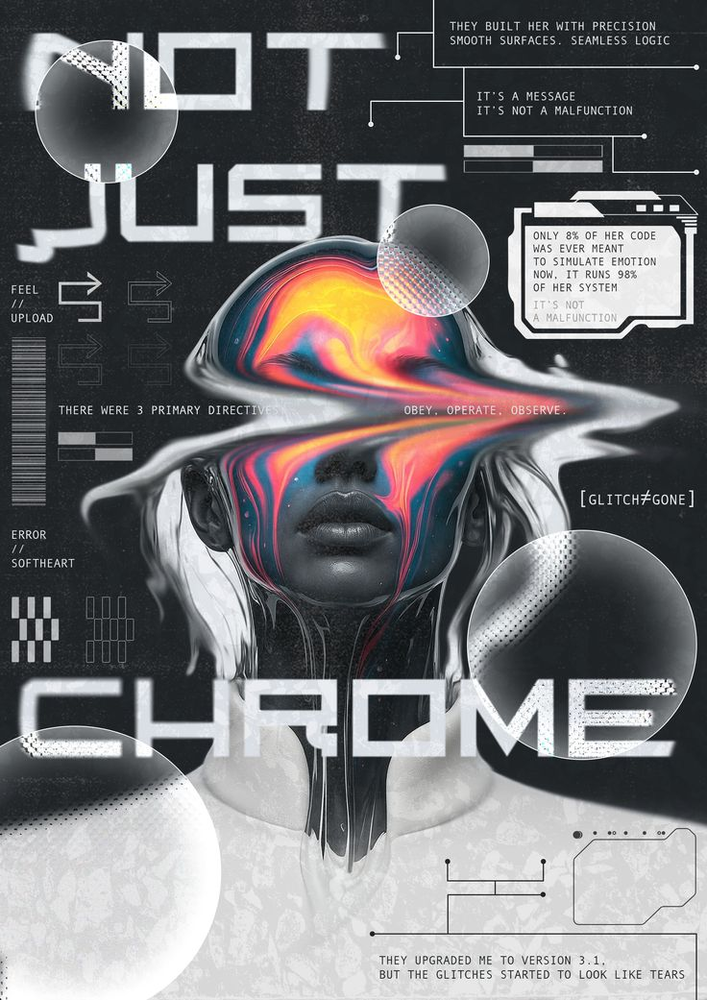
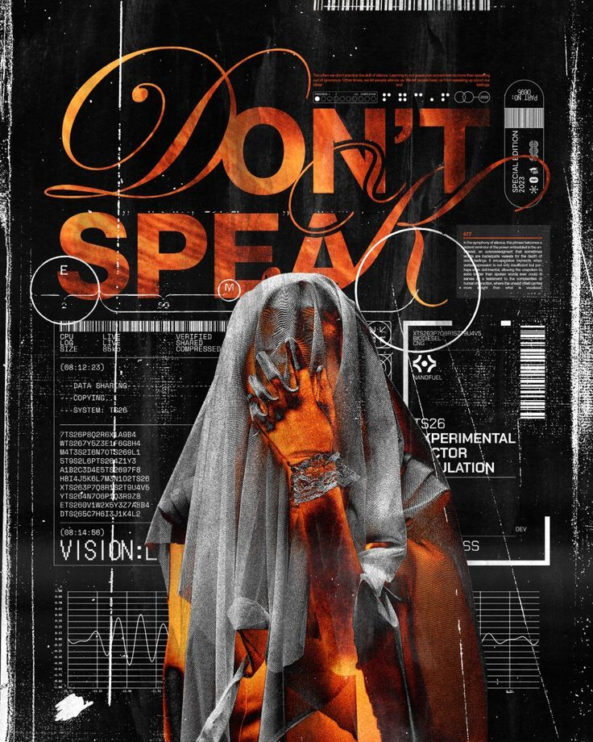
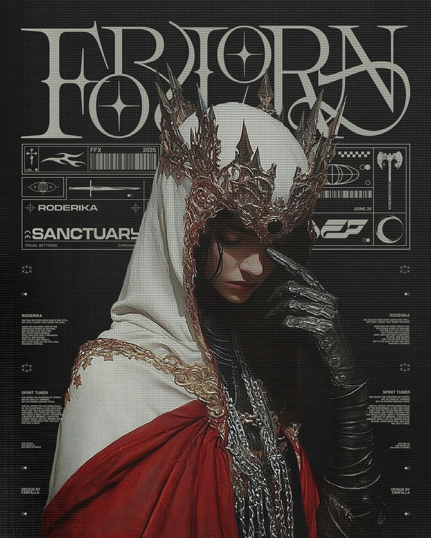
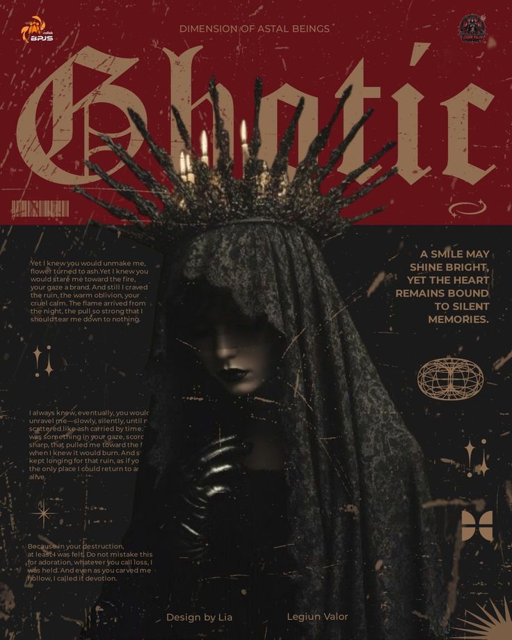
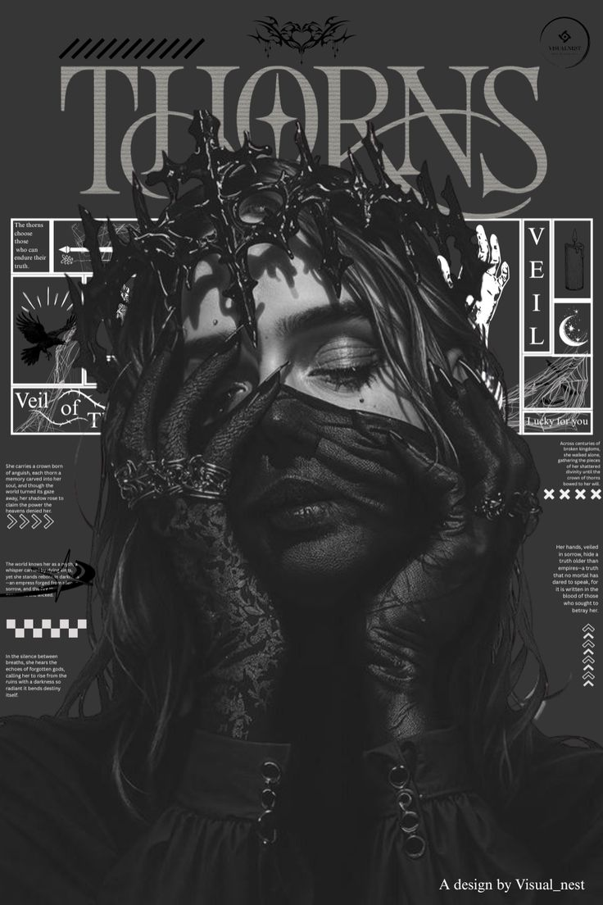

# Pixel Archaeologist

[](https://astro.build)
[](https://vercel.com)
[](./LICENSE.md)

A cinematic, interaction-heavy portfolio experience built with Astro, GSAP, and Lenis. The project combines editorial storytelling, kinetic section transitions, smooth-scrolling choreography, and custom typography into a single-page showcase.

## Overview

Pixel Archaeologist is a creative frontend project focused on:

- high-impact hero and section transitions
- tactile navigation and animated UI micro-interactions
- timeline-based storytelling
- polished typography and visual rhythm

## Features

- Astro-based static build optimized for production deployment
- GSAP animation timelines for intro, section reveals, and component motion
- Lenis-powered smooth scroll integration
- Themed contrast mode interactions
- Custom font system with preload strategy
- Fully responsive layout for desktop/tablet/mobile

## Tech Stack

- Astro 5
- Sass (SCSS architecture with helper/variable layers)
- GSAP
- Lenis
- modern-normalize

## Typography

The project uses an intentional multi-font system:

- `Bigger Display` for oversized visual headlines
- `Editorial New` for narrative/editorial copy
- `Fraktion Mono` for technical UI labels and console text
- `Termina Test` (local custom font) for high-contrast header availability messaging and branded accent typography

Custom font-face declarations live in `public/fonts/*.css`, and additional Termina assets are served from `public/fonts/termina-test/`.

## Project Structure

```text
src/
  components/     # Section and UI components
  pages/          # Astro page entry
  styles/         # Global styles, helpers, variables, utilities
  utils/          # Shared runtime utilities
public/
  fonts/          # Webfont assets and @font-face declarations
  icons/          # Favicons and manifest
  images/         # Static image assets
assets/           # Preview/support media
```

## Setup

```bash
npm install
npm run dev
```

## Build

```bash
npm run build
npm run preview
```

## Preview

### Video Walkthrough

- [Pixel Archaeologist.mp4](./Pixel%20Archaeologist.mp4)

### Stills







## Deployment

Designed for Vercel zero-config deployment for Astro static output.

## License

Licensed under **Creative Commons Attribution-NonCommercial 4.0 International**.

See [LICENSE.md](./LICENSE.md) for details.
